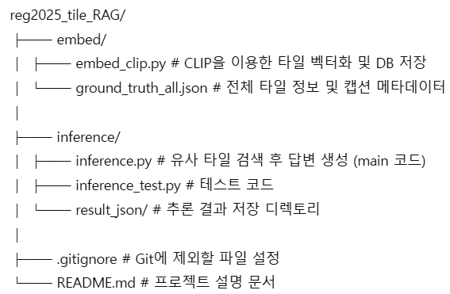

# reg2025_tile_RAG

**타일 기반 디지털 병리 이미지 검색 및 추론을 위한 RAG 시스템**

본 프로젝트는 병리 타일 이미지를 벡터화하여 데이터베이스에 저장하고, 질의(query)에 따라 유사 타일을 검색하여 정보를 추론하는 Retrieval-Augmented Generation(RAG) 구조로 구성되어 있습니다.

---

## 📁 프로젝트 구조



---

## 🔧 주요 기능

### 1️⃣ 타일 임베딩 (embed/)

- `embed_clip.py`  
  - CLIP 모델을 사용하여 병리 타일을 임베딩합니다.
  - ChromaDB 등에 저장 가능하도록 벡터 데이터로 변환합니다.

- `ground_truth_all.json`  
  - 각 타일 디렉토리와 대응되는 정답 병리 리포트 캡션 의미.
  - 타일 디렉토리(.tiff)는 슬라이드 ID 기준으로 매핑되며, 추론 시 라벨 정답으로 활용됩니다.

### 2️⃣ 추론 및 검색 (inference/)

- `inference.py`  
  - 입력 질의(Query)형식에 따라 test 타일 임베딩 
  - 임베딩 타일을 사용하여 DB에서 유사 타일 검색
  - 검색된 타일 정보 기반으로 유사도 기반 모델이 응답 생성 (RAG)

- `inference_test.py`  
  - RAG 시스템 테스트용 코드 (train db와 test tile 검증용)

- `result_json/`  
  - 추론 결과를 JSON 형식으로 저장합니다.
  - 슬라이드 ID별로 최종 추론된 병리 리포트를 포함한 JSON 파일이 저장되는 디렉토리입니다.
  - 후속 평가나 시각화에 사용됩니다.

---

## 🚀 실행 방법

```bash
# 타일 벡터화 (최초 1회)
cd embed/
python embed_clip.py

# 질의 기반 유사 타일 검색 및 응답
cd ../inference/
python inference.py  # 지정된 디렉토리 별 답변 추론.
