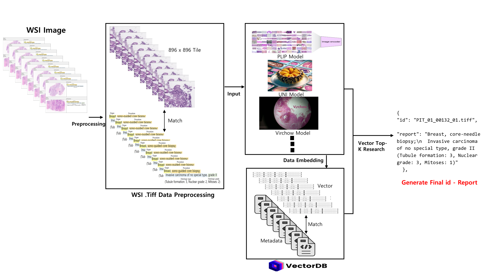
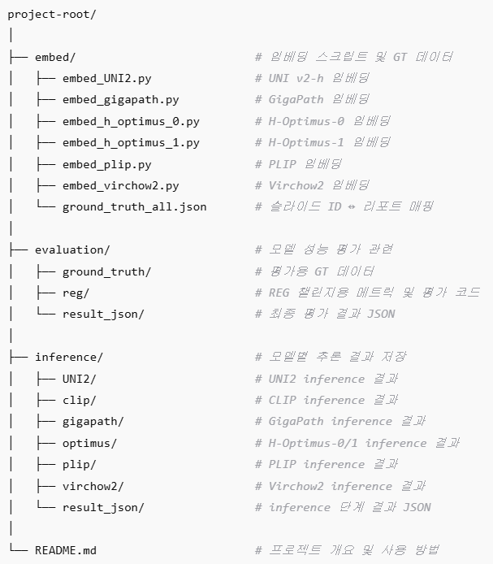
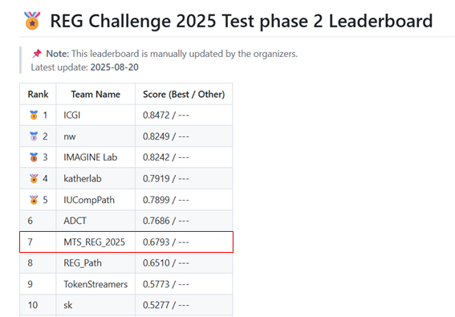

# REG2025_tile_RAG

**타일 기반 디지털 병리 이미지 검색 및 추론을 위한 RAG 시스템**

본 프로젝트는 병리 타일 이미지를 벡터화하여 데이터베이스에 저장하고, 타일 이미지에 따라 유사 타일을 검색하여 캡션 정보를 추론하는 Retrieval-Augmented Generation(RAG) 구조로 구성되어 있습니다.

## 📁 알고리즘 구조

---

## 📁 프로젝트 구조

---

## 🔧 주요 기능

### 1️⃣ 타일 임베딩 (embed/)

- `embed_UNI2.py`  
  - 모델: MahmoodLab UNI v2-h (ViT 계열 대규모 병리 기반 FDN).  
  - 특징: 타일 표현력이 강하고 전반적 **범용성/일관성** 우수.  
  - 권장 용도: 기본 베이스라인, 타일-KNN/RAG 1순위.  

- `embed_gigapath.py`  
  - 모델: GigaPath 기반 병리 특화 비전 인코더.  
  - 특징: 초대규모 병리 프리트레이닝으로 **WSI 전역 패턴**에 강함.  
  - 권장 용도: UNI2와 Late-fusion 조합, 조직 유형 다양할 때 보완재.  

- `embed_h_optimus_0.py`  
  - 모델: H-Optimus-0 (병리 도메인 최적화 변형 ①).  
  - 특징: 비교적 가벼워 **추론 속도/메모리 효율**이 좋음.  
  - 권장 용도: 리소스 제약 환경, 다모델 앙상블의 경량 파트.  

- `embed_h_optimus_1.py`  
  - 모델: H-Optimus-1 (병리 도메인 최적화 변형 ②).  
  - 특징: 0 대비 표현력 개선, 일부 케이스에서 **민감도 상승**.  
  - 권장 용도: 0번과 함께 쌍으로 비교/앙상블 시 안정성 확보.  

- `embed_plip.py`  
  - 모델: PLIP (Pathology-Language Image Pretraining), CLIP 구조 병리 특화.  
  - 특징: **텍스트-이미지 정렬 성능**이 좋아 캡션·리포트 매칭에 강함.  
  - 권장 용도: 텍스트 유사도 기반 RAG, 보고서 문장 스코어링 보조.  

- `embed_virchow2.py`  
  - 모델: Virchow2 패치 임베딩 (병리 특화 FDN).  
  - 특징: 미세 패턴(핵·조직학적 텍스처) 포착에 유리, **보완적 오류 상쇄** 효과.  
  - 권장 용도: UNI2/GigaPath와 보완 앙상블, 특정 아티팩트 많은 슬라이드.  

- `ground_truth_all.json`  
  - 슬라이드 ID ↔ 병리 리포트 캡션 매핑 데이터.  
  - 모든 임베딩 및 RAG 평가의 **기준 라벨**로 활용됩니다.  

### 2️⃣ 추론 및 검색 (inference/)

- `inference_clip.py`  
  - CLIP 모델을 통해 test 세트 타일을 임베딩합니다.  
  - 생성된 임베딩을 벡터 DB에서 검색하여 가장 유사한 타일을 반환합니다.  

- `inference_plip.py`  
  - PLIP 모델 임베딩을 사용한 RAG 추론 스크립트입니다.  
  - 병리학 도메인 특화 성능을 기대할 수 있으며, 병리 타일 검색 정확도가 일반 CLIP보다 향상됩니다.  

- `inference_UNI2.py`  
  - UNI2 모델 임베딩 기반 RAG 추론.  
  - 병리학 특화 최신 모델의 강점을 살려 높은 정밀도의 검색 결과를 제공합니다.  

- `inference_optimus.py`  
  - H-Optimus-0/1 임베딩 기반 RAG 추론.  
  - 대규모 병리 데이터 학습 효과로 병리 슬라이드 내 **미세 차이 구분**에 강점이 있습니다.  

- `inference_gigapath.py`  
  - GigaPath 임베딩 기반 RAG 추론.  
  - 초대규모 병리 사전학습 모델로, **WSI 전역 패턴** 탐지에 강점이 있으며 UNI2와 보완적으로 활용할 수 있습니다.  

- `inference_virchow2.py`  
  - Virchow2 임베딩 기반 RAG 추론.  
  - 병리학 특화 모델로, **세포/조직학적 미세 패턴** 탐지에 유리하며 다른 모델과의 앙상블 시 효과적입니다.  

- `result_json/`  
  - 추론 결과 저장 디렉토리.  
  - 슬라이드 ID별 최종 추론 병리 리포트가 **JSON 형식**으로 저장되며, 후속 평가·통계·시각화 작업에 활용됩니다.  
  - 평가 모듈(`evaluation/`)에서 성능 지표 계산 시 이 JSON 데이터를 입력으로 사용합니다.  

---

# Test set Result & REG_2025 Result

## 📊 최신 성능 결과 (Test Set 기준, 2025-08-21)

| 모델          | 정확도(%) / 점수 |
|---------------|------------------|
| UNI2          | **72.48**        |
| Gigapath      | 69.36            |
| H-Optimus-1   | 68.75            |
| H-Optimus-0   | 68.00            |
| PLIP          | 67.58            |
| CLIP          | 64.66            |
| virchow2      | 63.49            |

> 평가 데이터셋: 2025년 8월 14일 기준, **100개 tiff 타일로 구성된 test set**에서 reg2025 챌린지에서 제공한 **캡션과의 일치도**를 기준으로, 동일한 RAG 파이프라인 구성에서 모델별 임베딩 결과를 비교한 성능 지표입니다.

## 📊 대회 성능 결과 (Testphase2, 2025-08-21)

- 1000장 규모 pathology report 기준(testphase2) 0.6793점 달성

