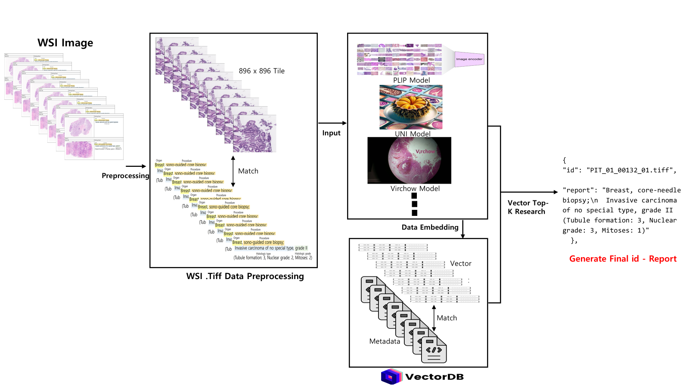

# reg2025_tile_RAG

**타일 기반 디지털 병리 이미지 검색 및 추론을 위한 RAG 시스템**

본 프로젝트는 병리 타일 이미지를 벡터화하여 데이터베이스에 저장하고, 타일 이미지에 따라 유사 타일을 검색하여 캡션 정보를 추론하는 Retrieval-Augmented Generation(RAG) 구조로 구성되어 있습니다.


## 📁 알고리즘 구조




---

## 📁 프로젝트 구조


---

## 🔧 주요 기능

### 1️⃣ 타일 임베딩 (embed/)

- `embed_clip.py`  
  - **CLIP(OpenAI)** 모델을 사용하여 병리 타일 이미지를 벡터(임베딩)로 변환합니다.
  - 변환된 임베딩은 ChromaDB 등 벡터 데이터베이스에 저장 가능하며, 이후 검색·RAG(Retrieval-Augmented Generation) 과정에서 활용됩니다.
  - 범용 이미지-텍스트 매핑 모델로 병리학 특화 성능은 다소 제한적입니다.

- `embed_plip.py`  
  - **PLIP(`vinid/plip`)** 모델을 사용하여 병리 타일을 임베딩합니다.  
  - CLIP 아키텍처를 기반으로 병리학 데이터로 추가 학습된 모델로, 병리 특이적 패턴·색상·형태 정보를 더 잘 반영합니다.
  - 임베딩 후 저장·검색 구조는 `embed_clip.py`와 동일하지만, 의료 병리 도메인에서 더 높은 검색 품질을 기대할 수 있습니다.

- `embed_h_optimus_0.py`  
  - **H-Optimus-0** 병리학 특화 비전 모델 기반 임베딩 생성.
  - 대규모 병리 슬라이드 데이터로 학습된 모델로, 병리 슬라이드의 미세 구조 차이를 잘 구분하도록 최적화되어 있습니다.

- `embed_UNI2.py`  
  - **UNI2** 모델 기반 임베딩 생성.
  - 다양한 병리 이미지 태스크에서 높은 성능을 보이는 최신 병리학 특화 모델입니다.
  - 대규모 멀티코호트 병리 데이터로 학습되어 색상·염색 편차에도 강인합니다.

- `ground_truth_all.json`  
  - 각 타일 디렉토리와 대응되는 정답 병리 리포트 캡션을 매핑한 파일입니다.
  - 슬라이드 ID(.tiff) 기준으로 타일과 라벨을 연결하며, 추론 성능 평가 시 기준 데이터로 사용됩니다.

---

### 2️⃣ 추론 및 검색 (inference/)

- `inference.py`  
  - clip 모델을 통해 test 세트 타일을 임베딩합니다.  
  - 생성된 임베딩을 벡터 DB에서 검색하여 가장 유사한 타일을 반환합니다.
  - 반환된 타일의 정답 캡션을 기반으로 최종 응답을 생성하는 RAG 프로세스의 핵심입니다.

- `inference_plip.py`  
  - PLIP 모델 임베딩을 사용한 RAG 추론 스크립트입니다.
  - 병리학 도메인 특화 성능을 기대할 수 있으며, 병리 타일 검색 정확도가 일반 CLIP보다 향상됩니다.

- `inference_UNI2.py`  
  - UNI2 모델 임베딩 기반 RAG 추론.
  - 병리학 특화 최신 모델의 강점을 살려 높은 정밀도의 검색 결과를 제공합니다.

- `inference_optimus.py`  
  - H-Optimus-0 임베딩 기반 RAG 추론.
  - 대규모 병리 데이터 학습 효과로 병리 슬라이드 내 미세 차이 구분에 강점이 있습니다.

- `result_json/`  
  - 추론 결과 저장 디렉토리.
  - 슬라이드 ID별 최종 추론 병리 리포트가 JSON 형식으로 저장되며, 후속 평가·통계·시각화 작업에 활용됩니다.
  - 평가 모듈(`evaluation/`)에서 성능 지표 계산 시 이 JSON 데이터를 입력으로 사용합니다.


---

## 🚀 실행 방법

```bash
# 타일 벡터화 (최초 1회) (해당 원하는 디렉토리에서 실행(모델 별로 실행 가능) 
cd embed/
python embed_clip.py

# 질의 기반 유사 타일 검색 및 응답
cd ../inference/
python inference.py (해당 원하는 디렉토리에서 실행)  # 지정된 디렉토리 별 답변 추론.
